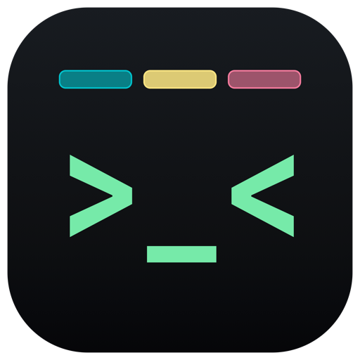
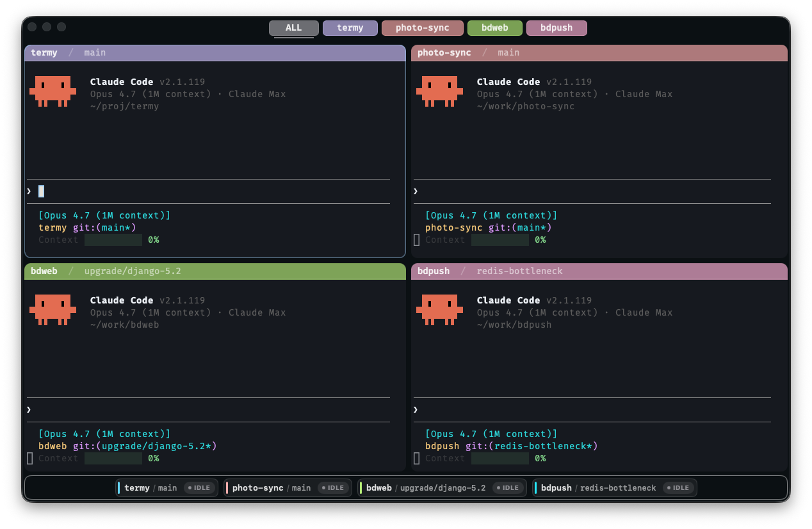
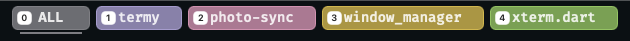
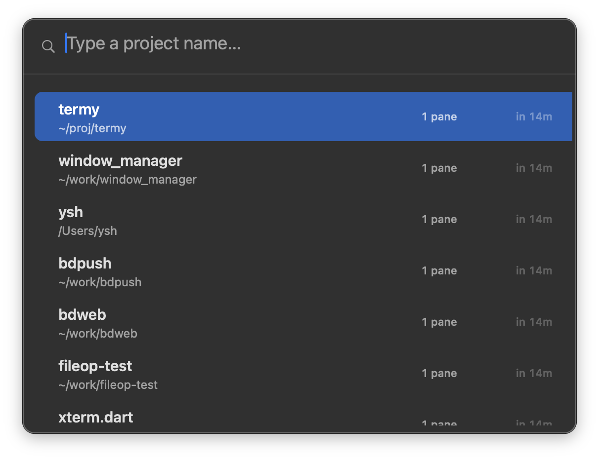
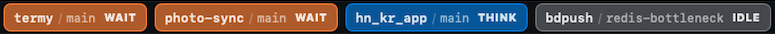
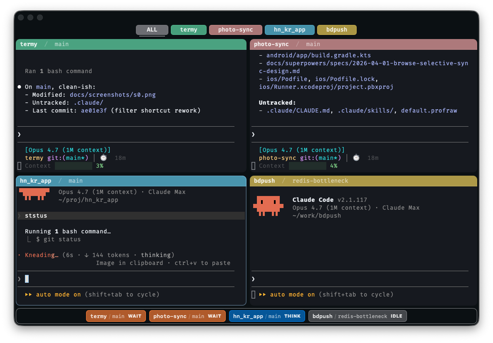
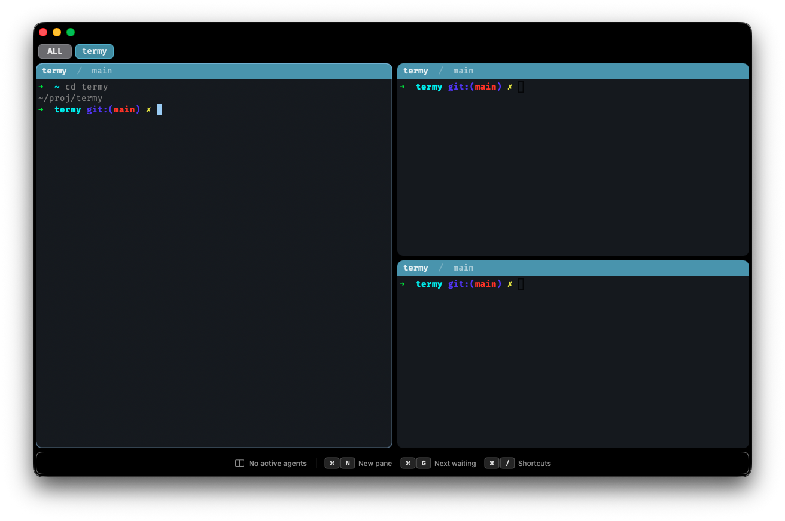
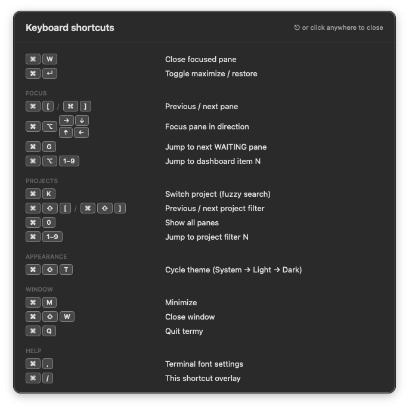
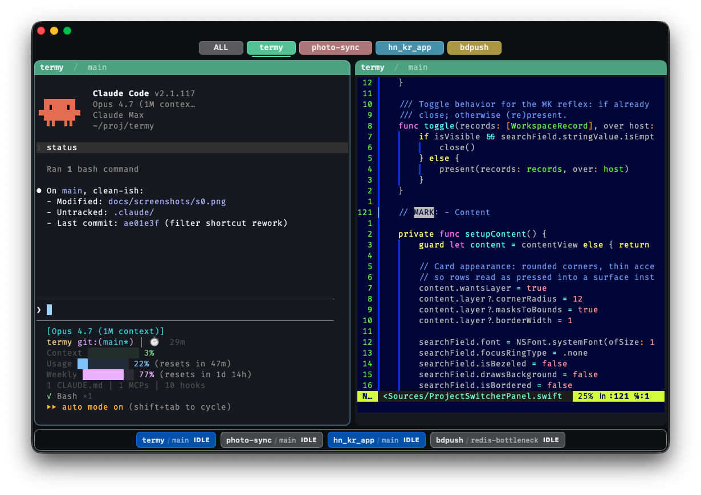

<p align="center">
  
</p>

<h1 align="center">termy</h1>

<p align="center"><strong>Mission control for Claude Code and Codex CLI.</strong></p>

<p align="center">
  A native macOS terminal built for running many coding agents at once —<br/>
  so you always know which one is blocked, working, or waiting on you.
</p>

<p align="center">
  
</p>

<p align="center">
  <em>Press <kbd>⌘</kbd><kbd>G</kbd> to jump straight to the next <b>WAIT</b> agent.</em>
</p>

---

## Why termy

Running N coding agents — Claude Code, Codex CLI, or a mix — in a stock
terminal turns into tab roulette: which session is blocked on a permission
prompt, which is mid-tool, which already finished? You end up Cmd-Tabbing
through windows, scanning panes, and missing the one that was waiting on
you five minutes ago.

**termy pulls that state out of the panes and into a glanceable dashboard.**
Every running agent — Claude Code or Codex CLI — gets a chip at the bottom
of the window with its live status: `IDLE`, `THINK`, or `WAIT`. When
something goes `WAIT`, macOS notifies you — even if termy isn't focused.
One keystroke takes you there.

## Projects, not tabs

Other terminals give you tabs. termy gives you **projects**.

Every pane belongs to a project (its cwd), and the top filter bar shows one
pill per project. Click `termy` to see only the `termy` panes. Click `ALL` to
see everything. Same project → same pastel accent everywhere — pane header,
dashboard chip, filter pill — so a four-agent window stops looking like a
soup of identical black rectangles.

<p align="center">
  
</p>

**Hold <kbd>⌘</kbd>** and a number appears on every filter pill. Press the
number — you're there. <kbd>⌘</kbd><kbd>0</kbd> is always *All*; <kbd>⌘</kbd><kbd>1</kbd>–<kbd>⌘</kbd><kbd>9</kbd>
jump straight to that project's pane grid. No tab order to memorize, no
cycling through things you don't care about.

Prefer names? <kbd>⌘</kbd><kbd>K</kbd> opens a fuzzy project switcher over
every project termy has seen, with pane counts and "last used" timestamps.
Picking one restores that project's saved pane grid.

<p align="center">
  
</p>

## A dashboard for every agent

The strip along the bottom of the window is one chip per running agent —
Claude Code or Codex CLI, mixed freely. Each chip shows **project / branch**
and a live state:

<p align="center">
  
</p>

- **`IDLE`** — agent is at the prompt, nothing running.
- **`THINK`** — tool call in flight.
- **`WAIT`** — blocked on a permission prompt. Your attention needed.

<kbd>⌘</kbd><kbd>G</kbd> jumps to the next `WAIT` pane, wherever it is —
across splits, across project filters. The single most useful keystroke in
the app.

**Hold <kbd>⌘</kbd><kbd>⌥</kbd>** and a number appears on each dashboard
chip; press the number to focus that pane directly, even if it's in a
different project filter.

## See it in action

<table>
  <tr>
    <td width="50%" align="center">
      <br/>
      <sub><b>State shows up everywhere.</b> Pane border, dashboard chip, and a macOS notification — all driven by Claude Code's <code>Notification</code> and <code>Stop</code> hooks.</sub>
    </td>
    <td width="50%" align="center">
      <br/>
      <sub><b>Splits, not tabs.</b> Nested <code>NSSplitView</code>s. Drag to resize. <kbd>⌘</kbd><kbd>D</kbd> for a row split, <kbd>⇧</kbd><kbd>⌘</kbd><kbd>D</kbd> for a column.</sub>
    </td>
  </tr>
  <tr>
    <td width="50%" align="center">
      <br/>
      <sub><b><kbd>⌘</kbd><kbd>/</kbd> reveals everything.</b> The full shortcut map — focus, projects, splits, window. No hidden bindings.</sub>
    </td>
    <td width="50%" align="center">
      <br/>
      <sub><b>Lives next to your editor.</b> Light, Dark, or Match System — <em>View → Appearance</em> switches terminal, chrome, and dashboard together.</sub>
    </td>
  </tr>
</table>

## What else you get

- **Permission-prompt notifications.** Claude goes `WAIT` → macOS pings you,
  even if termy isn't focused.
- **Workspace that survives.** Splits, project grouping, and cwd are all
  persisted per project. <kbd>⌘</kbd><kbd>K</kbd> a project and termy
  rebuilds the pane grid you left it in.
- **Real splits.** <kbd>⌘</kbd><kbd>D</kbd> row split, <kbd>⇧</kbd><kbd>⌘</kbd><kbd>D</kbd>
  column. Drag dividers. <kbd>⌘</kbd><kbd>⏎</kbd> toggles maximize.
- **Native, not Electron.** AppKit + SwiftTerm. **2 MB signed DMG**, ~3.6 MB
  installed. Real `UserNotifications`, Full Disk Access, titlebar chrome.

### Claude Code hooks

First launch asks once — *"Install termy hooks into Claude Code?"* — and the
app merges its entries into `~/.claude/settings.json`, preserving any hooks
you already have. Every entry is tagged `_termy_managed: true` so uninstall
is surgical, and the previous file is backed up to
`settings.json.backup-<ts>` before any write.

- **If you move the app**, the next launch detects the stale path and
  silently re-registers against the new location.
- **To uninstall**, use the <kbd>termy</kbd> menu → *Claude Code Hooks…* →
  *Uninstall*. Your own hooks are untouched.
- **`termy-hook`** always exits `0` and write-timeouts after 100 ms — it
  cannot stall Claude Code even if termy isn't running.

### Codex CLI hooks

Codex CLI is supported via the same `termy-hook` binary and an analogous
TOML installer that writes to `~/.codex/config.toml`. If termy detects a
Codex install (it probes `~/.codex` and the common Homebrew / npm / cargo /
mise / asdf install paths), it will offer to install the integration on
first launch; otherwise opt in any time via <kbd>termy</kbd> menu →
*Codex Hooks…*

Mappings (per `developers.openai.com/codex/hooks`):

| Codex event | Pane state |
|---|---|
| `SessionStart` | hard reset to `IDLE` |
| `PreToolUse` / `PostToolUse` | `THINK` |
| **`PermissionRequest`** | **`WAIT`** + macOS notification |
| `Stop` | `IDLE` after 30 s |

Codex has no native `SessionEnd` hook; termy synthesizes one by watching
the foreground process group of each pane's PTY (`tcgetpgrp` + libproc).
Once `codex` leaves the foreground (`/exit`, Ctrl-C), the chip resets to
neutral `INIT` automatically — even though no hook fired.

#### Caveat: Codex hooks don't cover every state transition

Claude Code exposes a complete state-tracking surface: `Notification` fires
the moment Claude stops to ask for input, and `Stop` fires when the agent
finishes a turn. Codex's hook surface is narrower. There's no
`Notification`-equivalent — `PermissionRequest` fires only for explicit
permission asks, not the general "I'm waiting on you" pauses that reasoning
models (GPT-5, o-series) lean on. Result: a Codex pane can sit silent at a
`>` prompt with no hook ever firing.

termy fills the gap with a two-stage silence detector: ~8 s of PTY quiet
moves the chip to a silent `POSSIBLY_WAITING` (visual only, no sound), and
~12 s of further quiet promotes it to `WAITING` (chip + macOS notification).
Any byte from the PTY reverts the silent state instantly. The trade-off:
Codex `WAIT` lands ~20 s after the agent actually paused rather than
instantly, and the false-positive rate isn't zero. If Codex ships a
`Notification`-equivalent in future, termy will switch to it and drop the
heuristic.

## Keyboard cheatsheet

| | |
|---|---|
| <kbd>⌘</kbd><kbd>G</kbd> | **Jump to next `WAIT` pane** |
| <kbd>⌘</kbd><kbd>0</kbd> | Show all projects |
| <kbd>⌘</kbd><kbd>1</kbd>–<kbd>9</kbd> | Jump to project filter N (hold <kbd>⌘</kbd> to see numbers) |
| <kbd>⌘</kbd><kbd>⌥</kbd><kbd>1</kbd>–<kbd>9</kbd> | Jump to dashboard chip N (hold <kbd>⌘</kbd><kbd>⌥</kbd> to see numbers) |
| <kbd>⌘</kbd><kbd>K</kbd> | Fuzzy project switcher |
| <kbd>⌘</kbd><kbd>[</kbd> / <kbd>⌘</kbd><kbd>]</kbd> | Previous / next pane |
| <kbd>⌘</kbd><kbd>⌥</kbd><kbd>←↑↓→</kbd> | Focus pane in direction |
| <kbd>⌘</kbd><kbd>D</kbd> / <kbd>⇧</kbd><kbd>⌘</kbd><kbd>D</kbd> | Split row / column |
| <kbd>⌘</kbd><kbd>⏎</kbd> | Toggle maximize focused pane |
| <kbd>⌘</kbd><kbd>W</kbd> | Close focused pane |
| <kbd>⌘</kbd><kbd>/</kbd> | Full shortcut overlay |

## How it works

```
Claude Code ──hook──▶ termy-hook (CLI) ──unix socket──▶ HookDaemon (in-app actor)
   Codex CLI ──hook──▶ termy-hook --agent codex ──┘                   │
                                                                       │
                                                              ┌────────┴────────┐
                                                              ▼                 ▼
                                                       PaneStateMachine    fg-process watcher
                                                              │              (synthetic
                                                              ▼               SessionStart/End)
                                                MissionControlView + Notifier
```

- **SwiftTerm** renders the PTY and owns the child shell lifecycle.
- **`termy-hook`** is a tiny Swift CLI that Claude Code invokes per hook
  event. It slims the payload and sends one JSON line over
  `/tmp/termy-$UID.sock`.
- **`HookDaemon`** is an actor that receives those events and runs them
  through `PaneStateMachine`, the pure reducer covered by 74 unit tests.
- **Synthetic `PtyExit`** fills the gap Claude Code's hooks can't: hard
  crashes (Ctrl+C mid-response, SIGKILL) fire no hook, so termy emits a
  synthetic event on PTY EOF. Details in `docs/project-overview.md`.

## Status

The core loop is working end-to-end:

- SwiftTerm panes with OSC 7 cwd tracking, splits, and <kbd>⌘</kbd>-click URL open
- Hook daemon + `termy-hook` end-to-end
- XCTest coverage over the state machine, fuzzy match, persistence, and
  filter layout
- Workspace autosave + restore with project-scoped pane grids
- Developer ID-signed, notarized DMG pipeline (`scripts/dist.sh`)

## Not in v1

See `TODOS.md` for deferred work — screen-scraping fallback for non-hook
agents, separate LaunchAgent daemon, user-editable hook config, per-project
settings UI.

## Internals

- `docs/project-overview.md` — architecture, runtime, hook system constraints
- `TODOS.md` — scoped-out work with reasoning
- `apps/termy/Sources/` — the app (25 files)
- `apps/termy-hook/Sources/` — the hook helper CLI
- `apps/termy-tests/Sources/` — 74 tests across 8 suites
